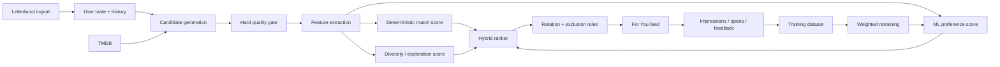
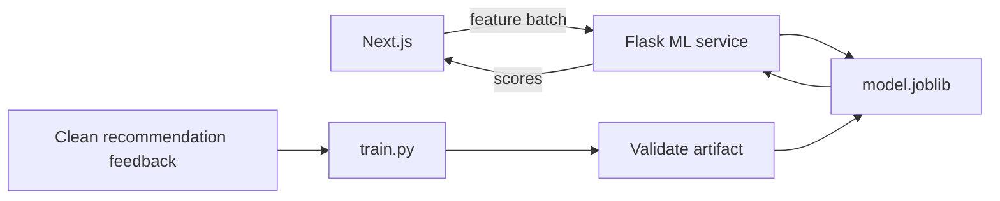
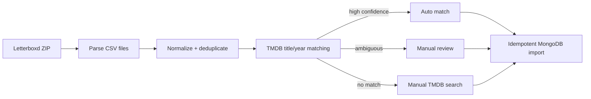
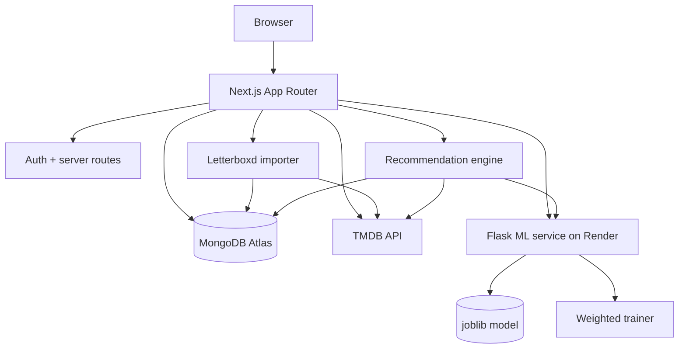

# Memento

**A personal film companion that learns your taste instead of just storing your watch history.**

[](https://memento-sable.vercel.app/)


Memento combines film tracking, a Letterboxd-grade diary, TMDB discovery, and a hybrid recommendation system that mixes deterministic taste signals with a weighted machine-learning ranker.

> Built with Next.js, TypeScript, MongoDB Atlas, TMDB, Flask, and scikit-learn.

## Live Demo

**Production app:** https://memento-sable.vercel.app/

The Next.js application is deployed on **Vercel**, backed by **MongoDB Atlas**, with the recommendation model served independently from **Render**.

---

## Why Memento?

Most movie trackers are good at remembering what you watched. Recommendation systems are usually black boxes that ignore the context behind *why* you liked something.

Memento tries to do both.

It builds a living taste profile from:

- watched films
- ratings
- likes
- watchlist behaviour
- recommendation opens
- "Seen" / "Not for me" feedback
- favourite films and genres
- imported Letterboxd history
- international-film affinity
- obscurity / deep-cut affinity

That profile feeds a hybrid ranking pipeline that gets better as the user interacts with the product.

---

## Highlights

- **Hybrid recommendation engine** combining ML, deterministic taste matching, and controlled diversity.
- **17-feature weighted ML ranker** served through a dedicated Flask microservice.
- **Automatic model retraining** once enough new cleaned recommendation feedback accumulates.
- **Letterboxd ZIP importer** for watched films, ratings, likes, watchlist, diary entries, reviews, rewatches, and custom lists.
- **Confidence-based TMDB matching** with manual review for ambiguous films.
- **Idempotent imports** — importing the same Letterboxd archive again updates data instead of duplicating it.
- **Personal film diary** with ratings, reviews, rewatches, likes, and spoiler handling.
- **Watchlist and watched-library filtering** by title, genre, rating, and sort preferences.
- **Custom ranked/unranked lists** with public/private visibility.
- **Movie detail pages** with cast, trailers, providers, ratings, logging, and interaction controls.
- **Adaptive recommendation exploration** for international and obscure cinema.
- **Refresh rotation** that avoids immediately recycling the same recommendation set.

---

## Recommendation System

Memento does not ask a single model to do everything.



### Hybrid score

The current ranking blend is:

```text
55% learned ML preference
30% deterministic taste match
15% diversity / exploration
```

If the ML service is unavailable, Memento falls back to deterministic ranking rather than taking down the recommendation experience.

### Recommendation signals

The feature pipeline includes signals such as:

- genre affinity
- seeded similarity
- TMDB rating
- Memento rating
- Memento rating count
- popularity
- vote strength
- obscurity
- international status
- watched-count / experience
- candidate source
- recommendation style

Imported Letterboxd history enriches the user's taste profile but does **not** masquerade as Memento recommendation impressions, keeping the ML feedback dataset semantically clean.

---

## ML Service

The ranking model runs separately from the Next.js application.



The trainer uses sample weighting so weak neutral impressions do not drown out stronger explicit signals.

The deployed model exposes health metadata such as:

```json
{
  "modelLoaded": true,
  "featureCount": 17,
  "usesSampleWeights": true,
  "trainedDatasetRows": 793,
  "lastTrainingTrigger": "automatic"
}
```

Automatic retraining checks the cleaned dataset and retrains only after the configured threshold of genuinely new usable rows is reached.

---

## Letterboxd Import

Memento accepts a standard Letterboxd data-export ZIP.

### Imported data

- watched films
- ratings
- likes
- watchlist
- diary entries
- rewatches
- reviews
- custom lists

### Matching pipeline



The importer preserves list ordering and ignores Letterboxd collaborators because a collaborator on Letterboxd does not imply a corresponding Memento account.

---

## Core Product Features

### Film discovery

Browse trending and top-rated films, search globally, inspect full movie details, cast, trailers, and India-specific provider availability.

### For You

A recommendation feed shaped by the user's actual viewing history and evolving behaviour.

Users can:

- bookmark directly from a recommendation poster
- mark films as seen
- mark recommendations "Not for me"
- refresh picks without immediately seeing the same batch again

### Watched library

Search, sort, and filter the full watched collection by genre and personal rating.

Liking or rating a film automatically marks it as watched.

### Watchlist

Search and filter saved films by genre and TMDB rating, with independent sorting by title, release year, recency, or TMDB score.

### Diary

Track each viewing separately with:

- date
- rating
- review
- spoilers
- like status
- rewatch status

### Lists

Build public/private ranked or unranked movie lists.

Letterboxd custom lists can be imported while preserving order.

---

## Architecture



---

## Tech Stack

### Frontend / application

- Next.js 16
- React
- TypeScript
- Tailwind CSS
- shadcn/ui
- Lucide icons

### Backend / data

- Next.js Route Handlers
- MongoDB Atlas
- Mongoose

### Recommendation / ML

- Python
- Flask
- scikit-learn
- pandas
- joblib
- Gunicorn

### External APIs

- TMDB
- JustWatch provider data through TMDB

### Deployment

- Vercel — Next.js application
- Render — Flask ML microservice
- MongoDB Atlas — persistent database

---

## Production Architecture

```text
User
  │
  ▼
Vercel — Next.js application
  ├── MongoDB Atlas — persistent application data
  ├── TMDB — movie metadata and discovery
  └── Render — Flask ML ranking service
          └── trained 17-feature recommendation model
```

The production deployment has been verified across authentication, persistent watchlist/watched state, diary and list flows, Letterboxd import, recommendation generation, and the remote ML ranking service.

---

## Project Structure

```text
memento/
├─ src/
│  ├─ app/
│  │  ├─ api/
│  │  │  ├─ import/letterboxd/
│  │  │  ├─ ml/
│  │  │  ├─ movies/
│  │  │  └─ tmdb/
│  │  └─ (app)/
│  ├─ components/
│  ├─ lib/
│  ├─ models/
│  └─ types/
│
├─ ml-service/
│  ├─ app.py
│  ├─ train.py
│  └─ model.joblib
│
├─ docs/
└─ public/
```

---

## Local Development

### 1. Install the Next.js app

```bash
npm install
```

Create `.env.local`:

```env
MONGODB_URI=
TMDB_ACCESS_TOKEN=
JWT_SECRET=

ML_SERVICE_URL=http://127.0.0.1:8001
ML_RETRAIN_SECRET=
ML_RETRAIN_MIN_NEW_ROWS=50
```

Add any other authentication secrets required by the current auth configuration.

Run:

```bash
npm run dev
```

### 2. Start the ML service

```bash
cd ml-service
python -m venv .venv
```

Windows:

```bash
.venv\Scripts\activate
```

macOS / Linux:

```bash
source .venv/bin/activate
```

Install dependencies:

```bash
pip install -r requirements.txt
```

Create `ml-service/.env`:

```env
ML_RETRAIN_SECRET=
ML_RETRAIN_MIN_NEW_ROWS=50
```

Start Flask locally:

```bash
python app.py
```

The Next.js app and ML service must use the **same** `ML_RETRAIN_SECRET`.

---

## Retraining

Manual training:

```bash
cd ml-service
python train.py
```

The application also supports threshold-based automatic retraining.

The current default threshold is:

```text
50 new cleaned / usable training rows
```

Raw duplicate or weak rows do not directly count toward that threshold.

---

## Environment Variables

Never commit real secrets.

Typical values used by the project include:

```env
MONGODB_URI=
TMDB_ACCESS_TOKEN=
JWT_SECRET=

ML_SERVICE_URL=
ML_RETRAIN_SECRET=
ML_RETRAIN_MIN_NEW_ROWS=50

NEXT_PUBLIC_APP_URL=
```

---

## Engineering Decisions

A few choices were deliberate:

- **Imported Letterboxd history is not inserted as fake recommendation feedback.**
- **Watched and watchlisted are mutually exclusive.**
- **Rating or liking implies watched.**
- **Ambiguous TMDB matches require user review.**
- **Re-importing Letterboxd data is idempotent.**
- **ML failure does not take down recommendations.**
- **Model retraining is thresholded rather than triggered after every interaction.**
- **Recommendation rotation is temporary UI state, not permanent taste data.**

---

## Portfolio Demo Flow

For a short demo:

1. Open **For You** and explain the hybrid recommendation score.
2. Bookmark a recommendation directly from its poster.
3. Mark another recommendation as seen.
4. Rate or like a film and show that it enters Watched automatically.
5. Open the Diary and demonstrate rewatches/reviews.
6. Show Watchlist filtering and custom lists.
7. Upload a Letterboxd export and show TMDB matching/manual review.
8. Show the deployed ML health metadata and automatic retraining state.

This demonstrates the product, full-stack engineering, data migration, and ML lifecycle without turning the demo into a code tour.

---

## Roadmap

The core portfolio product is feature-complete and deployed.

Future work is focused on:

- production monitoring and observability
- richer recommendation evaluation
- larger real-world training datasets
- additional model experiments
- improved cold-start recommendation strategies

---

## Author

Built by **Kaniska Mitra**.
